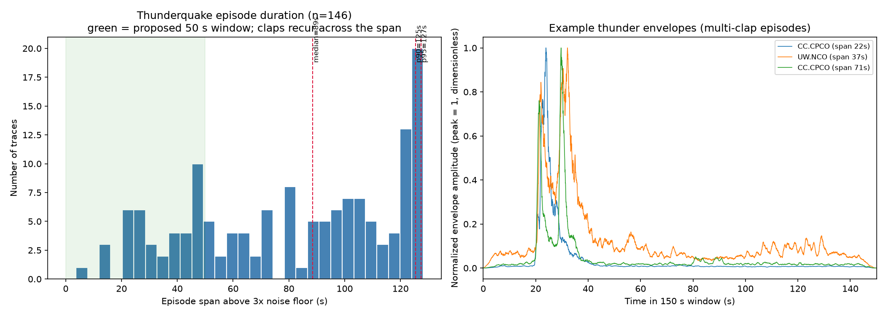
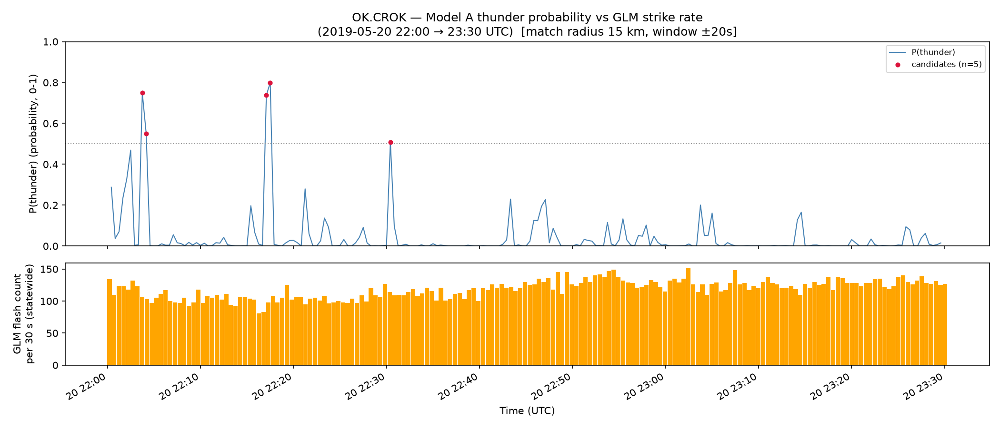
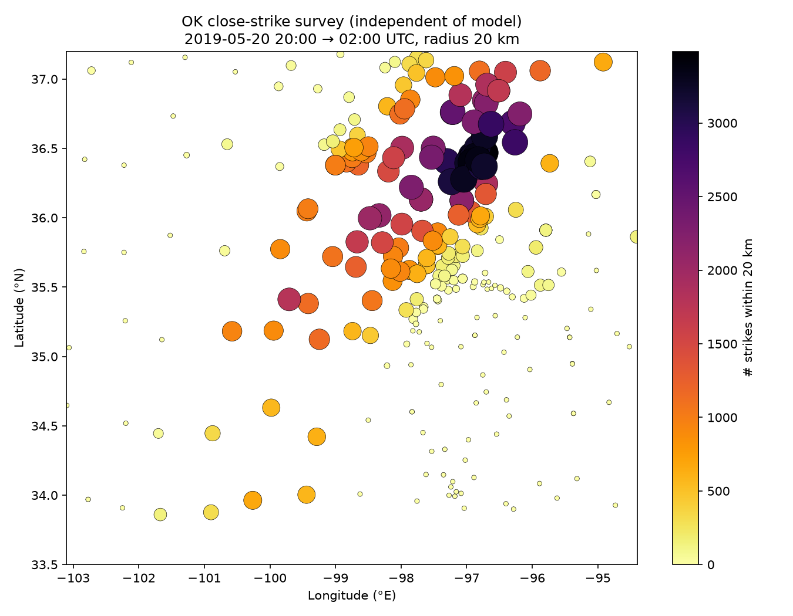
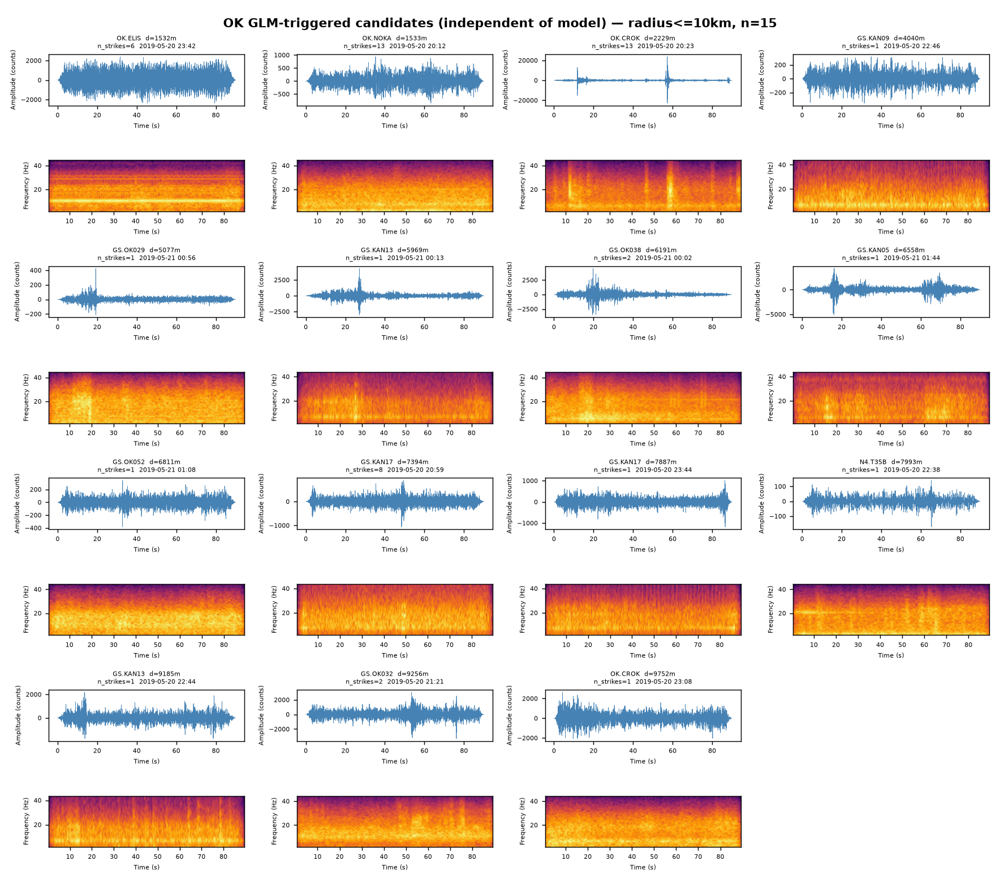
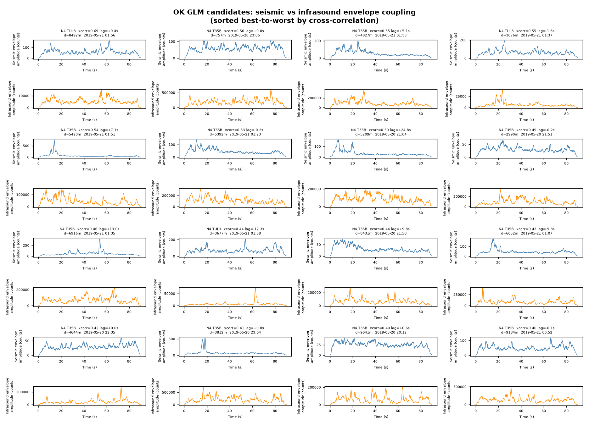

::: {.callout-note}
This is a **progress report**, not a finished manuscript. It documents the current state of the pipeline, the data and methods used so far, and an honest accounting of what worked, what didn't, and what remains open. Section 6 lists concrete follow-up work. All figures are generated by scripts in `scripts/` and are regenerable from the data root (see `data/README.md`); none are illustrative mockups.
:::

# Introduction

Lightning-detection networks — satellite-based (GOES-GLM) and ground-based (WWLLN, ALDN, commercial networks) — systematically undercount strikes in remote terrain, at high latitude, and wherever their sensor geometry or detection efficiency is poor. A **thunderquake** is the ground-motion signature thunder produces when it couples into the earth, either directly (a weak elastic wave from the lightning channel) or via the airborne acoustic front arriving at the speed of sound. Where a seismometer (and, better, a co-located infrasound microphone) sits near enough to a strike, it records this coupling — offering an independent way to detect lightning that a purely optical or radio-frequency network might miss.

This project aims to detect thunderquakes with machine learning across three priority regions, in order:

1. **Oklahoma (OK)** — the highest-priority target: dense induced-seismicity monitoring infrastructure, frequent severe convective weather, but (as this report will show) **zero existing thunder labels**.
2. **Pacific Northwest (PNW)** — home of the [PNWML dataset](https://github.com/niyiyu/PNWML), which contains the only analyst-labeled `thunder` class available to this project.
3. **Alaska (AK)** — sparse independent lightning ground-truth (GOES-GLM detection efficiency degrades badly at high latitude), but the densest co-located seismic+infrasound coverage of the three regions (the Alaska Transportable Array).

The work reported here covers five workstreams (WS0–WS4 in the project's [GitHub issue tracker](https://github.com/gaia-hazlab/thunderquakes/issues)): repository/environment setup, signal characterization, station inventory, open lightning-catalog access, and a first convolutional neural network (CNN) with an initial cross-region generalization test.

## Why this matters

Two negative results shape the whole approach and are worth stating up front, because they eliminated paths that looked promising on paper:

- **A prior prototype tried to validate PNWML thunder labels against ASOS airport weather observations and found 0% co-location** — ASOS stations sit at airports; PNWML's thunder-labeled seismic stations sit in remote mountains tens of kilometers away. This ruled out ASOS as a label or validation source entirely (see `notebooks/archive/`).
- **PNWML's `thunder` class contains no Oklahoma examples.** All 146 labeled thunder traces come from three Pacific Northwest networks (CC, UW, PB). Any model trained on PNWML alone is, by construction, a PNW model — deploying it to Oklahoma is a genuine cross-region generalization problem, not a simple application of an existing detector.

# Data

## PNWML — the only labeled thunder dataset

The [PNW Machine Learning (PNWML) dataset](https://github.com/niyiyu/PNWML) provides analyst-labeled seismic waveforms for the Pacific Northwest, including a `thunder` class (146 traces) alongside `sonic boom` (206), `surface event` (8,912), and a large `noise` pool. Because the local copy of PNWML's waveform archive was incomplete, this project **reconstructs waveforms directly from FDSN** using the PNWML metadata (station, channel, start time) — fully reproducible without needing the multi-gigabyte HDF5 archive, and verified to reproduce PNWML's exact 150 s / 100 Hz windows (596/596 traces successfully refetched in characterization; see `thunderquakes.data.cache` for the on-disk waveform cache that makes this repeatable and fast).

Two classes were adopted as region-aware negatives: `surface event` and `sonic boom` are genuine confusers for thunder in PNW/AK, but `surface event` is not a real source type in Oklahoma, so the OK-targeted model training set uses only `{thunder, sonic boom, noise}` (`earthquake`/`explosion` are intentionally excluded — an existing classifier, QuakeXNet, already covers those classes).

## Station inventories (seismic + infrasound)

A full FDSN + IRIS-PH5 inventory was built for all three regions, distinguishing **acoustic-rate infrasound channels** (`BDF`/`BDO`/`HDF`, usable for ~1–20 Hz thunder acoustics) from low-rate meteorological pressure (`LDF`/`LDM`/`LDO`, not usable), and cross-checked against the FDSN **availability** service (actual archived-data extents, not just nominal metadata epochs — these frequently disagree).

| Region | Total stations | Seismoacoustic (seismic + infrasound) | Notes |
|---|---:|---:|---|
| OK | 2,493 | 18 | Includes the 2016 LASSO (2,081 nodes) and IRIS Community Wavefield (383, 9 seismoacoustic) temporary deployments |
| PNW | 1,151 | 64 | Cascades Volcano Observatory network + a statewide Oregon `BDF/BDO` deployment |
| AK | 763 | 356 | The Alaska Transportable Array carries infrasound almost everywhere |

::: {layout-ncol=3}

:::

The inversion between regions is important: **Oklahoma has abundant seismic coverage but almost no infrasound (0.7% of stations); Alaska has infrasound almost everywhere (47% of stations) but the weakest independent lightning ground-truth.** This shapes what infrasound can realistically contribute in each region (§4.5).

## Open lightning catalogs

Per an explicit locked decision, only **open** lightning catalogs are used (no commercial license):

- **GOES-GLM** (Geostationary Lightning Mapper) — public on AWS S3, no credentials required. Primary ground truth for OK and PNW (good CONUS coverage, 2018–present). A loader (`thunderquakes.lightning.glm`) reads L2 flash-centroid granules directly from `s3://noaa-goes{16,19}/GLM-L2-LCFA/`, with threaded fetching and retry-with-backoff (a real reliability bug — a single transient S3 connection reset could crash a multi-hour fetch — was found and fixed during this work).
- **WWLLN** (World Wide Lightning Location Network) — a loader is implemented against the standard located-stroke file format, ready for use once data access is arranged (WWLLN is operated by UW's own Earth & Space Sciences department, so an institutional path exists). This is the primary option for Alaska and for dates before GLM's 2018 start.
- **ALDN** (Alaska Lightning Detection Network) — identified as the region-specific option for Alaska; not yet implemented.

GLM is optical and reports flash energy, not peak current; both GLM and WWLLN are **lower bounds** on true lightning activity, not ground truth in the strict sense — detection efficiency varies by network and region, which matters for how results are interpreted throughout.

# Methods

## Signal characterization

Per-trace features (dominant frequency, spectral centroid/bandwidth/flatness, envelope duration, band-energy ratios, kurtosis — `thunderquakes.features.characterize`) were computed for all four PNWML classes to establish what physically distinguishes thunder from its confusers before any model was built.

::: {layout-ncol=2}

:::

A duration analysis (onset-free — the PNWML `trace_P_arrival_sample` field is a placeholder for thunder, not a true onset, so duration was measured from the envelope directly) found that individual claps last a few seconds, but a full thunderquake **episode** spans a median of 89 s across multiple recurring claps, with only ~39 s of that time actually above the noise floor.

This directly determined the CNN input window: **50 s at 100 Hz, with a 25 s (50%) stride** — long enough to hold the dominant burst, short enough to keep multiple independent classification opportunities across a long episode, and much shorter than PNWML's native 150 s window.

## Seismo-acoustic coupling

At stations with a co-located infrasound microphone, thunder produces a physically distinctive signature: the seismic and infrasound envelopes should correlate strongly at a small, near-zero lag, because both channels are excited by the same passing acoustic front. This was measured (`thunderquakes.features.seismoacoustic.seismo_acoustic_lag`, envelope cross-correlation with a physically bounded lag search) at three co-located PNW stations (CC.CPCO/KWBU/SVIC) for the labeled thunder class, and later reused as an independent verification tool for candidate Oklahoma events (§4.5).

## CNN classifier (Model A, seismic-only)

A 2D CNN over log-spectrograms of the 50 s windows, with three deliberate design choices motivated by review feedback on an initial baseline:

- **Anti-aliased downsampling**: plain strided max-pooling aliases spectrogram structure, so every downsampling block uses `MaxBlurPool2d` (Zhang 2019: max-pool at stride 1, then a fixed binomial low-pass filter at stride 2).
- **Architecture width vs. depth**: a short-and-fat configuration (64 channels, 3 blocks) was compared against a long-and-skinny one (16 channels, 5 blocks) and a baseline (32 channels, 3 blocks). Short-fat won on both PNW and OK-targeted training.
- **Training-only augmentation** (`thunderquakes.models.augment`): amplitude scaling, polarity flip, white-noise dithering, and — most importantly — **real-noise injection sampled from the noise class in the training split only**, applied strictly after the station-disjoint train/test split to avoid leakage.

Splits are **station-disjoint** (no station appears in both train and test), which is the honest precursor to a true cross-region generalization test, since random splits would let the model memorize station-specific characteristics.

## GLM-triggered candidate extraction (Oklahoma)

Because PNWML contains no Oklahoma thunder labels, a **model-independent** extraction pipeline was built to source real OK candidates: rather than trusting the model's own flagged detections (which risks reinforcing its existing confusions), the pipeline finds times and stations where an **independent GLM lightning strike** landed close to a seismometer, extracts the real waveform there, and defers to human visual verification before anything is treated as a label.

The pipeline has three stages:

1. **Survey** (`scripts/survey_ok_close_strikes.py`): proximity-check every GLM strike in a known-active convective window against all permanent OK stations.
2. **Cluster + extract** (`scripts/extract_ok_thunder_candidates.py`): collapse storm-burst strikes into distinct time-gap-separated events (a single storm cell produces many strikes in seconds, which should count as one physical episode, not many), filter out sustained-overhead-storm clusters, and fetch the real waveform — centered on the **physically expected acoustic arrival time** (distance / 340 m s⁻¹), not a fixed offset, since GLM detection is essentially instantaneous while the seismic arrival lags by up to ~29 s at the 10 km search radius used.
3. **Seismoacoustic verification** (`scripts/verify_seismoacoustic_candidates.py`): for the subset of candidates that happen to fall at a seismoacoustic station, compute the same envelope cross-correlation used in §3.2 as an additional, physically grounded quality check.

## Statistical generalization test

To ask whether a PNW-trained model carries any real signal into Oklahoma, the trained OK-targeted model was run over **continuous** seismic data at several stations during a known-active convective window, and its flagged ("candidate") windows were matched against nearby GLM strikes. Because GLM strike density during an active storm is very high statewide (roughly one flash every 0.2–0.25 s), a raw match-rate is close to meaningless on its own — almost any window matches *something* nearby purely because a storm was active. The test therefore always compares the **candidate match rate** against a **null baseline**: the identical match test applied to a same-size random sample of *all* sliding windows, not just the model's candidates. A two-proportion z-test (`thunderquakes.evaluation.two_proportion_ztest`) then asks whether the candidate rate significantly exceeds the null rate.

# Results and Quality Control

## PNWML signal characterization

Thunder has the highest spectral centroid of the four classes (10.2 Hz vs. 6.3 Hz for surface events) and uniquely concentrates energy in the 10–20 Hz band (41% vs. 10% for surface events). Noise is trivially separable (flat spectrum, near-zero kurtosis, fills the full window). **Sonic boom is the closest confuser** — both are broadband, high-kurtosis, acoustically coupled transients — which anticipates and explains a persistent confusion seen later in the classifier (§4.3).

| Class | Dominant freq (Hz) | Spectral centroid (Hz) | Spectral flatness | Duration₈₀ (s) | Kurtosis | Energy 10–20 Hz |
|---|---:|---:|---:|---:|---:|---:|
| Thunder | 6.4 | 10.2 | 0.044 | 34.1 | 27.9 | 0.41 |
| Sonic boom | 5.3 | 8.4 | 0.029 | 42.8 | 32.5 | 0.24 |
| Surface event | 4.3 | 6.3 | 0.016 | 24.8 | 16.5 | 0.10 |
| Noise | 5.0 | 9.4 | 0.067 | 111.7 | 0.3 | 0.17 |

## Waveform verification galleries

Before trusting any label — PNWML's or the newly extracted OK candidates' — waveform+spectrogram galleries were generated for direct human review, rather than trusting summary statistics alone.

::: {layout-ncol=2}

:::

The thunder and sonic-boom galleries look visually similar — both are impulsive, multi-burst, broadband signals — confirming that their confusion in the classifier (§4.3) reflects genuine physical similarity, not a labeling error.

## CNN classifier performance

A first baseline (no BlurPool, no augmentation, PNW 4-class) scored **thunder PR-AUC 0.61** against a 0.37 base rate, with confusion concentrated exactly where characterization predicted: thunder vs. surface-event and thunder vs. sonic-boom. After the hardening described in §3.3, an **OK-targeted 3-class model (thunder/sonic boom/noise) reached PR-AUC 0.73**, with thunder/noise separation now essentially perfect (zero cross-errors) and all remaining error concentrated in thunder↔sonic-boom.

**Caveat that applies to every result in this section**: this model has never seen a single confirmed Oklahoma thunderquake. It is a PNW model, curated to Oklahoma's expected class mix, evaluated so far only on PNW-network data.

## The Oklahoma generalization test

Running the OK-targeted model over continuous data at OK.CROK during the 2019-05-20 severe-weather outbreak and matching its candidate windows against GLM strikes at a physically motivated radius (15 km — roughly thunder's audible/coupling range) and window (±20 s) gave, at a single station, a 40% candidate match rate vs. a 20% null baseline — directionally interesting but far too small a sample (n=5) to trust.

Scaling to **five geographically spread stations** over a 6-hour window (with a shared GLM fetch reused across all of them) gave a pooled result of **54% candidate match rate vs. 42% null, z = 1.46, p = 0.072** — suggestive but short of conventional significance. The important qualitative signal is the *direction*: every station with any candidates (CROK, NOKA, N4.T35B) showed a candidate rate at or above its null rate; none went the other way, which a pure-noise result across three independent stations would not be expected to do.

Two stations (FNO, RLOK) saw **zero** candidate windows in the full 6 hours — plausibly because the most active storm cells were concentrated further north/east that evening (confirmed visually by the close-strike survey map below), though this has not yet been independently verified against local strike density at those specific stations.

## GLM-triggered candidate extraction: sizing and QC

The close-strike survey found **12,650 (station, strike) pairs within 5 km and 48,151 within 10 km**, across up to 198 of Oklahoma's 282 permanent stations, from a single 6-hour storm — several strikes landed within 50–170 m of a seismometer.

After clustering into distinct episodes (median 1 strike per event) and filtering out sustained-overhead-storm clusters, this yielded **3,244 distinct candidate events** — establishing that Oklahoma is not sample-starved once an independent lightning-triggered extraction strategy is used. Human review of 15 fetched examples found roughly 5–6 with clean, discrete, broadband bursts matching the PNWML thunder signature (§4.1) directly, and several ambiguous/continuous cases plausibly reflecting genuine misses (a strike that landed nearby but wasn't audibly/seismically coupled at that particular station).

Two concrete methodological issues were found and fixed while building this: (1) window centering initially ignored the ~29 s acoustic travel-time lag at the 10 km search radius, pushing distant events toward the window edge; (2) many small Oklahoma local-network stations return "no data available" for specific candidate times despite nominally covering that period — consistent with the station-inventory finding that metadata epochs overstate real archived-data availability (§2.2).

## How much can infrasound help?

Of the 3,244 candidate events, only **59 (1.8%) fall at a permanent Oklahoma seismoacoustic station** — infrasound coverage is simply too sparse to verify most candidates. Among those 59, real seismic-infrasound coupling was computed for 47; only **13% (6/47) showed strong coupling** (cross-correlation ≥ 0.5), with a median of 0.35 — well below the PNW baseline in §4.1 (0.85), though that comparison is not apples-to-apples: the PNW number came from **analyst-curated** labels, while this Oklahoma population is raw and unfiltered, necessarily including real misses.

A weak but physically sensible negative correlation between coupling strength and strike distance (r ≈ −0.17 to −0.20) and visually co-varying envelope shapes in the best-ranked panels both indicate the metric is capturing real signal, not noise. The practical conclusion: **infrasound helps quality, not coverage** — it identifies a small, high-confidence subset suitable as gold-standard labels, but the bulk of the Oklahoma training set will have to rely on seismic-only verification.

# Follow-Up Work

In rough priority order, tracked as open GitHub issues:

1. **Automate candidate QC scoring** (issue #11) — replace fully manual gallery review with an automated pre-filter using the characterization features from §3.1 (spectral flatness, kurtosis, envelope duration), reserving human review for borderline cases.
2. **Expand the extraction beyond one storm** — more convective days and more stations are needed both to grow the candidate pool and to reach statistical significance on the generalization test (§4.4 currently sits at p = 0.072 on a single storm).
3. **Retrain/fine-tune on vetted Oklahoma candidates** and re-run the generalization test to see whether real OK-native training data closes the gap implied by the current PNW-only model.
4. **Verify the zero-candidate stations** (FNO, RLOK) against local GLM strike density directly, rather than inferring an explanation from the map.
5. **Implement the ALDN loader** for Alaska (issue #7) and obtain WWLLN data through the UW institutional path — both are needed before Alaska's lightning-side workstream can proceed, and Alaska is the region where infrasound coverage is best (§2.2) but independent ground truth is weakest.
6. **Uncertainty quantification** (issue #10) — MC-dropout and a small deep ensemble, with calibration checked via reliability diagrams / ECE, not yet implemented.
7. **Dual-branch (Model B) architecture** (issue #9) — motivated by §4.1 and §4.5, but scoped realistically: valuable at the handful of co-located sites, not as the primary Oklahoma labeling strategy.
8. **CI and automated report rendering** (issue #1) — this report should regenerate automatically from the pipeline rather than being assembled by hand.
