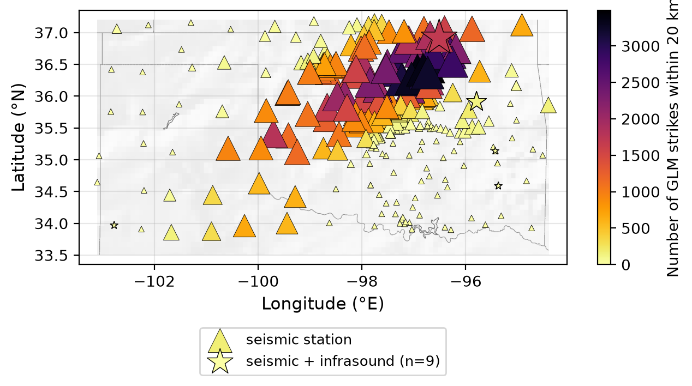
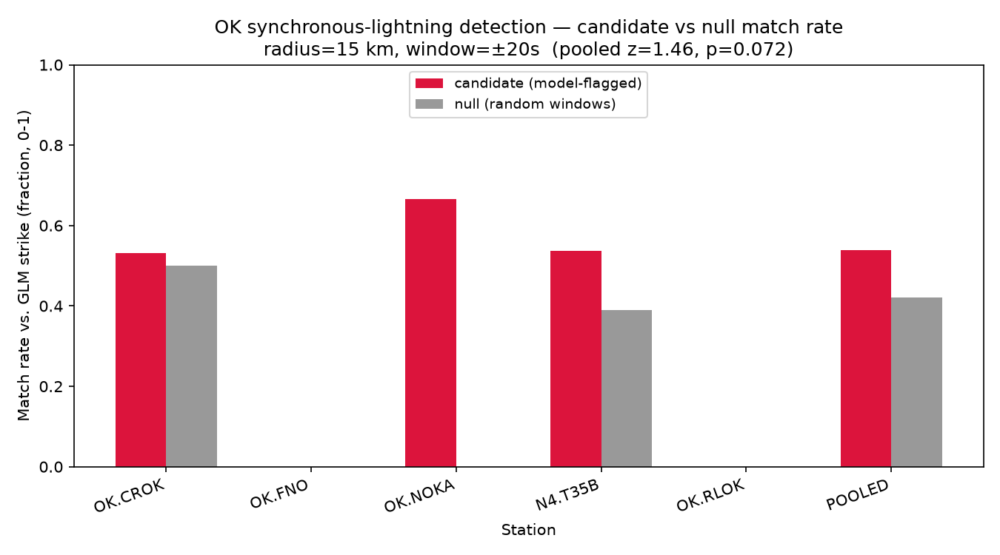

::: {.callout-note}
This is a **progress report**, not a finished manuscript. It documents the current state of the pipeline, the data and methods used so far, and an honest accounting of what worked, what didn't, and what remains open. Section 6 lists concrete follow-up work. All figures are generated by scripts in `scripts/` and are regenerable from the data root (see `data/README.md`); none are illustrative mockups. Figures deliberately carry no on-image titles — descriptive framing lives in the caption below each figure (and in its alt-text) so the plot itself stays uncluttered.
:::

# Introduction

Lightning-detection networks — satellite-based (GOES-GLM) and ground-based (WWLLN, ALDN, commercial networks) — systematically undercount strikes in remote terrain, at high latitude, and wherever their sensor geometry or detection efficiency is poor. A **thunderquake** is the ground-motion signature thunder produces when it couples into the earth, either directly (a weak elastic wave from the lightning channel) or via the airborne acoustic front arriving at the speed of sound. Where a seismometer (and, better, a co-located infrasound microphone) sits near enough to a strike, it records this coupling — offering an independent way to detect lightning that a purely optical or radio-frequency network might miss.

This project aims to detect thunderquakes with machine learning across three priority regions, in order:

1. **Oklahoma (OK)** — the highest-priority target: dense induced-seismicity monitoring infrastructure, frequent severe convective weather, but (as this report will show) **zero existing thunder labels**.
2. **Pacific Northwest (PNW)** — home of the [PNWML dataset](https://github.com/niyiyu/PNWML), which contains the only analyst-labeled `thunder` class available to this project.
3. **Alaska (AK)** — sparse independent lightning ground-truth (GOES-GLM detection efficiency degrades badly at high latitude), but the densest co-located seismic+infrasound coverage of the three regions (the Alaska Transportable Array).

The work reported here covers five workstreams (WS0–WS4 in the project's [GitHub issue tracker](https://github.com/gaia-hazlab/thunderquakes/issues)): repository/environment setup, signal characterization, station inventory, open lightning-catalog access, and a first convolutional neural network (CNN) with an initial cross-region generalization test.

## Why this matters

Two negative results shape the whole approach and are worth stating up front, because they eliminated paths that looked promising on paper:

- **A prior prototype tried to validate PNWML thunder labels against ASOS airport weather observations and found 0% co-location** — ASOS stations sit at airports; PNWML's thunder-labeled seismic stations sit in remote mountains tens of kilometers away. This ruled out ASOS as a label or validation source entirely (see `notebooks/archive/`).
- **PNWML's `thunder` class contains no Oklahoma examples.** All 146 labeled thunder traces come from three Pacific Northwest networks (CC, UW, PB). Any model trained on PNWML alone is, by construction, a PNW model — deploying it to Oklahoma is a genuine cross-region generalization problem, not a simple application of an existing detector.

# Data

## PNWML — the only labeled thunder dataset

The [PNW Machine Learning (PNWML) dataset](https://github.com/niyiyu/PNWML) provides analyst-labeled seismic waveforms for the Pacific Northwest, including a `thunder` class (146 traces) alongside `sonic boom` (206), `surface event` (8,912), and a large `noise` pool. Because the local copy of PNWML's waveform archive was incomplete, this project **reconstructs waveforms directly from FDSN** using the PNWML metadata (station, channel, start time) — fully reproducible without needing the multi-gigabyte HDF5 archive, and verified to reproduce PNWML's exact 150 s / 100 Hz windows (596/596 traces successfully refetched in characterization; see `thunderquakes.data.cache` for the on-disk waveform cache that makes this repeatable and fast).

Two classes were adopted as region-aware negatives: `surface event` and `sonic boom` are genuine confusers for thunder in PNW/AK, but `surface event` is not a real source type in Oklahoma, so the OK-targeted model training set uses only `{thunder, sonic boom, noise}` (`earthquake`/`explosion` are intentionally excluded — an existing classifier, QuakeXNet, already covers those classes).

## Station inventories (seismic + infrasound)

A full FDSN + IRIS-PH5 inventory was built for all three regions, distinguishing **acoustic-rate infrasound channels** (`BDF`/`BDO`/`HDF`, usable for ~1–20 Hz thunder acoustics) from low-rate meteorological pressure (`LDF`/`LDM`/`LDO`, not usable), and cross-checked against the FDSN **availability** service (actual archived-data extents, not just nominal metadata epochs — these frequently disagree). Maps show a light-grey shaded-relief basemap with coastlines and state/political borders (rendered via PyGMT, confined to near-white greys so it never competes with the station markers), equal physical lat/lon aspect (correcting for the cos(latitude) shrinkage of longitude degrees, which otherwise visibly squeezes high-latitude Alaska), and the "since &lt;year&gt;" annotation gives the first calendar year in which at least 10 stations of that type were simultaneously active, using actual archived-data extent rather than nominal metadata epochs.

| Region | Total stations | Seismoacoustic (seismic + infrasound) | Notes |
|---|---:|---:|---|
| OK | 2,493 | 18 | Includes the 2016 LASSO (2,081 nodes) and IRIS Community Wavefield (383, 9 seismoacoustic) temporary deployments |
| PNW | 1,151 | 64 | Cascades Volcano Observatory network + a statewide Oregon `BDF/BDO` deployment |
| AK | 763 | 356 | The Alaska Transportable Array carries infrasound almost everywhere |

::: {layout-ncol=3}
{fig-alt="Map of Oklahoma showing seismic stations as grey triangles, seismoacoustic stations as red stars, and a tan cluster of 2016 nodal stations near Enid, on a light-grey relief basemap with the state outline."}

{fig-alt="Map of Washington and Oregon showing dense grey seismic-station triangles and red seismoacoustic stars concentrated around Cascade volcanoes, on a light-grey relief basemap with coastline and state borders."}

{fig-alt="Map of Alaska showing hundreds of red seismoacoustic stars covering most of the state alongside grey seismic-only triangles, on a light-grey relief basemap with recognizable coastline, at correct equal-area aspect so the state is not vertically compressed."}
:::

The inversion between regions is important: **Oklahoma has abundant seismic coverage but almost no infrasound (0.7% of stations); Alaska has infrasound almost everywhere (47% of stations) but the weakest independent lightning ground-truth.** This shapes what infrasound can realistically contribute in each region (§4.6).

## Open lightning catalogs

Per an explicit locked decision, only **open** lightning catalogs are used (no commercial license):

- **GOES-GLM** (Geostationary Lightning Mapper) — public on AWS S3, no credentials required. Primary ground truth for OK and PNW (good CONUS coverage, 2018–present). A loader (`thunderquakes.lightning.glm`) reads L2 flash-centroid granules directly from `s3://noaa-goes{16,19}/GLM-L2-LCFA/`, with threaded fetching and retry-with-backoff (a real reliability bug — a single transient S3 connection reset could crash a multi-hour fetch — was found and fixed during this work).
- **WWLLN** (World Wide Lightning Location Network) — a loader is implemented against the standard located-stroke file format, ready for use once data access is arranged (WWLLN is operated by UW's own Earth & Space Sciences department, so an institutional path exists). This is the primary option for Alaska and for dates before GLM's 2018 start.
- **ALDN** (Alaska Lightning Detection Network) — identified as the region-specific option for Alaska; not yet implemented.

GLM is optical and reports flash energy, not peak current; both GLM and WWLLN are **lower bounds** on true lightning activity, not ground truth in the strict sense — detection efficiency varies by network and region, which matters for how results are interpreted throughout.

# Methods

## Signal characterization

Per-trace features (dominant frequency, spectral centroid/bandwidth/flatness, envelope duration, band-energy ratios, kurtosis — `thunderquakes.features.characterize`) were computed for all four PNWML classes to establish what physically distinguishes thunder from its confusers before any model was built.

::: {layout-ncol=2}
{fig-alt="Log-log line plot of median power spectrum for four PNWML classes -- thunder, sonic boom, surface event, noise -- from 1 to 45 Hz, with thunder and sonic boom elevated relative to surface event in the 10-20 Hz band."}

{fig-alt="Four boxplot panels comparing spectral flatness, duration, spectral centroid, and kurtosis across the four PNWML classes, showing noise as a clear outlier and thunder/sonic boom as the most similar pair."}
:::

A duration analysis (onset-free — the PNWML `trace_P_arrival_sample` field is a placeholder for thunder, not a true onset, so duration was measured from the envelope directly) found that individual claps last a few seconds, but a full thunderquake **episode** spans a median of 89 s across multiple recurring claps, with only ~39 s of that time actually above the noise floor.

{fig-alt="Two-panel figure: a histogram of episode durations peaking around 90-125 seconds with a green band marking 0-50 seconds, and a line plot of three example envelope traces each showing multiple amplitude bursts across a 150-second window."}

This directly determined the CNN input window: **50 s at 100 Hz, with a 25 s (50%) stride** — long enough to hold the dominant burst, short enough to keep multiple independent classification opportunities across a long episode, and much shorter than PNWML's native 150 s window.

## Seismo-acoustic coupling

At stations with a co-located infrasound microphone, thunder produces a physically distinctive signature: the seismic and infrasound envelopes should correlate strongly at a small, near-zero lag, because both channels are excited by the same passing acoustic front. This was measured (`thunderquakes.features.seismoacoustic.seismo_acoustic_lag`, envelope cross-correlation with a physically bounded lag search) at three co-located PNW stations (CC.CPCO/KWBU/SVIC) for the labeled thunder class, and later reused as an independent verification tool for candidate Oklahoma events (§4.6).

{fig-alt="Two-panel figure: a scatter plot of cross-correlation coefficient vs. envelope lag with most points clustered near zero lag and above 0.6 correlation, and a histogram of lag values peaking near zero."}

## CNN classifier (Model A, seismic-only)

A 2D CNN over log-spectrograms of the 50 s windows, with three deliberate design choices motivated by review feedback on an initial baseline:

- **Anti-aliased downsampling**: plain strided max-pooling aliases spectrogram structure, so every downsampling block uses `MaxBlurPool2d` (Zhang 2019: max-pool at stride 1, then a fixed binomial low-pass filter at stride 2).
- **Architecture width vs. depth**: a short-and-fat configuration (64 channels, 3 blocks) was compared against a long-and-skinny one (16 channels, 5 blocks) and a baseline (32 channels, 3 blocks). Short-fat won on both PNW and OK-targeted training.
- **Training-only augmentation** (`thunderquakes.models.augment`): amplitude scaling, polarity flip, white-noise dithering, and — most importantly — **real-noise injection sampled from the noise class in the training split only**, applied strictly after the station-disjoint train/test split to avoid leakage.

Splits are **station-disjoint** (no station appears in both train and test), which is the honest precursor to a true cross-region generalization test, since random splits would let the model memorize station-specific characteristics. **There is currently no separate validation split** — only train/test (`sklearn.model_selection.GroupShuffleSplit`, grouped on station, `test_frac=0.3`) — so model selection across the three architectures below uses the same test set the metrics are reported on; this is flagged explicitly as a limitation (§6) rather than glossed over, since it means the architecture choice itself has a small optimistic bias.

Three architectures were trained and compared under identical data/augmentation (`scripts/train_cnn.py`): a baseline (32 channels, 3 blocks), the short-fat winner (64 channels, 3 blocks), and a long-skinny alternative (16 channels, 5 blocks, each block doubling channels up to a 256-channel cap). Training was instrumented to log per-epoch train/test loss and accuracy (`catalogs/cnn_training_history_OK_*.csv`) and wall-clock training time, and a separate realistic-streaming inference benchmark (`thunderquakes.models.train.benchmark_inference`) measures latency at the batch size continuous deployment would actually use (one window at a time), not the large single-batch timing a training loop would otherwise make look artificially fast.

## GLM-triggered candidate extraction (Oklahoma)

Because PNWML contains no Oklahoma thunder labels, a **model-independent** extraction pipeline was built to source real OK candidates: rather than trusting the model's own flagged detections (which risks reinforcing its existing confusions), the pipeline finds times and stations where an **independent GLM lightning strike** landed close to a seismometer, extracts the real waveform there, and defers to human visual verification before anything is treated as a label.

The pipeline has three stages:

1. **Survey** (`scripts/survey_ok_close_strikes.py`): proximity-check every GLM strike in a known-active convective window against all permanent OK stations.
2. **Cluster + extract** (`scripts/extract_ok_thunder_candidates.py`): collapse storm-burst strikes into distinct time-gap-separated events (a single storm cell produces many strikes in seconds, which should count as one physical episode, not many), filter out sustained-overhead-storm clusters, and fetch the real waveform — centered on the **physically expected acoustic arrival time** (distance / 340 m s⁻¹), not a fixed offset, since GLM detection is essentially instantaneous while the seismic arrival lags by up to ~29 s at the 10 km search radius used.
3. **Seismoacoustic verification** (`scripts/verify_seismoacoustic_candidates.py`): for the subset of candidates that happen to fall at a seismoacoustic station, compute the same envelope cross-correlation used in §3.2 as an additional, physically grounded quality check.

## Statistical generalization test

To ask whether a PNW-trained model carries any real signal into Oklahoma, the trained OK-targeted model was run over **continuous** seismic data at several stations during a known-active convective window, and its flagged ("candidate") windows were matched against nearby GLM strikes. Because GLM strike density during an active storm is very high statewide (roughly one flash every 0.2–0.25 s), a raw match-rate is close to meaningless on its own — almost any window matches *something* nearby purely because a storm was active. The test therefore always compares the **candidate match rate** against a **null baseline**: the identical match test applied to a same-size random sample of *all* sliding windows, not just the model's candidates. A two-proportion z-test (`thunderquakes.evaluation.two_proportion_ztest`) then asks whether the candidate rate significantly exceeds the null rate.

## Seismoacoustic moveout check

The cross-correlation numbers in §3.5 show *that* seismic and infrasound envelopes correlate, but not whether the timing is *physically* consistent with a real acoustic wave rather than a coincidence. A genuine thunderquake's envelope lag should track strike-to-station distance at the speed of sound (~340 m/s) — the same moveout logic used to confirm a real seismic phase arrival across a network of stations for one event, applied here to one station's two channels across many events at different distances. `scripts/plot_seismoacoustic_moveout.py` computes the predicted travel time (distance / 340 m/s) for every OK candidate with a fetched seismic+infrasound pair and compares it against the observed envelope lag, and plots two raw-waveform (not envelope) "record section" examples for direct visual inspection.

# Results and Quality Control

## PNWML signal characterization

Thunder has the highest spectral centroid of the four classes (10.2 Hz vs. 6.3 Hz for surface events) and uniquely concentrates energy in the 10–20 Hz band (41% vs. 10% for surface events). Noise is trivially separable (flat spectrum, near-zero kurtosis, fills the full window). **Sonic boom is the closest confuser** — both are broadband, high-kurtosis, acoustically coupled transients — which anticipates and explains a persistent confusion seen later in the classifier (§4.3).

| Class | Dominant freq (Hz) | Spectral centroid (Hz) | Spectral flatness | Duration₈₀ (s) | Kurtosis | Energy 10–20 Hz |
|---|---:|---:|---:|---:|---:|---:|
| Thunder | 6.4 | 10.2 | 0.044 | 34.1 | 27.9 | 0.41 |
| Sonic boom | 5.3 | 8.4 | 0.029 | 42.8 | 32.5 | 0.24 |
| Surface event | 4.3 | 6.3 | 0.016 | 24.8 | 16.5 | 0.10 |
| Noise | 5.0 | 9.4 | 0.067 | 111.7 | 0.3 | 0.17 |

## Waveform verification galleries

Before trusting any label — PNWML's or the newly extracted OK candidates' — waveform+spectrogram galleries were generated for direct human review, rather than trusting summary statistics alone. Each panel is titled with its station and time; axes share the common 50 s time base and (within spectrograms) the common frequency band, so tick labels are drawn once per row/column rather than repeated on every panel.

::: {layout-ncol=2}
{fig-alt="Grid of four waveform-and-spectrogram pairs for PNWML-labelled thunder events, each showing a sharp broadband amplitude burst and a corresponding bright vertical band in the spectrogram."}

{fig-alt="Grid of four waveform-and-spectrogram pairs for PNWML-labelled sonic boom events, visually similar in shape and spectral content to the thunder gallery."}
:::

The thunder and sonic-boom galleries look visually similar — both are impulsive, multi-burst, broadband signals — confirming that their confusion in the classifier (§4.3) reflects genuine physical similarity, not a labeling error.

## CNN classifier performance

### Datasets and splits

Two separate training runs underlie every model discussed in this report — an early **PNW 4-class baseline** (pre-BlurPool, pre-augmentation, kept as a frozen historical artifact since the current code no longer has a toggle to reproduce it) and the **OK-targeted 3-class architecture comparison** (post-hardening: BlurPool + augmentation). Both use a station-disjoint 70/30 train/test split (§3.3) with no separate validation set.

| Run | Classes | n train | n test | Test-set class support |
|---|---|---:|---:|---|
| PNW baseline | thunder, sonic boom, surface event, noise | 319 | 277 | thunder 102, sonic boom 95, surface event 49, noise 31 |
| OK-targeted (×3 architectures) | thunder, sonic boom, noise | 1,360 | 106 | thunder 22, sonic boom 38, noise 46 |

The OK run's `n_train=1,360` is 340 raw station-disjoint training windows expanded ×4 by train-only augmentation (original + 3 augmented copies per window, §3.3); the raw PNWML class pool behind that 340 draws from the full metadata (**thunder 146, sonic boom 206, surface event 8,912**, plus 51,462 raw noise traces — `exotic_metadata.csv`/`noise_metadata.csv`, region-subsampled to `n_per_class=150` per §2.1's negative-class curation).

### Architectures compared

Three architectures were trained under identical data/augmentation to separate "does width vs. depth matter" from "did augmentation/BlurPool help":

{fig-alt="Three horizontal diagrams of box sequences representing CNN blocks: baseline goes 32 to 64 to 128 channels (93,507 parameters), short-fat goes 64 to 128 to 256 channels (371,331 parameters), long-skinny goes 16 to 32 to 64 to 128 to 256 channels across five blocks (394,083 parameters), each ending in an average-pool plus fully-connected head."}

| Architecture | Width | Depth | Params | Thunder PR-AUC | Accuracy | Precision / Recall (thunder) |
|---|---:|---:|---:|---:|---:|---|
| `baseline_w32_d3` | 32 | 3 | 93,507 | 0.684 | 0.726 | 0.48 / 0.91 |
| `short_fat_w64_d3` (**deployed**) | 64 | 3 | 371,331 | **0.732** | 0.783 | 0.68 / 0.59 |
| `long_skinny_w16_d5` | 16 | 5 | 394,083 | 0.658 | 0.774 | 0.60 / 0.68 |

Short-fat wins on the headline metric (thunder PR-AUC), but the **learning curves below show why long-skinny's raw numbers are less trustworthy than they look**: at a similar parameter count to short-fat, its extra depth lets train loss keep falling long after test loss has flattened — classic overfitting on this small a training set, not a genuinely better representation.

{fig-alt="Two rows of three line-plot panels, one column per architecture: top row shows train and test cross-entropy loss vs epoch, bottom row shows train and test accuracy vs epoch. The long-skinny architecture's train loss keeps decreasing toward the end of training while its test loss stays flat or rises, unlike the other two architectures."}

### Leaderboard

A **majority-class baseline** (always predict the largest test-set class) is included for both runs — its accuracy is just the majority class's test-set prevalence, and its "thunder PR-AUC" is exactly the thunder class's prevalence (the average-precision score of any constant-output classifier equals the positive class's base rate), which is also the honest zero-information floor every trained model must beat.

| Model | Test set | Accuracy | Thunder PR-AUC |
|---|---|---:|---:|
| Majority-class baseline | PNW 4-class (n=277) | 36.8% | 0.368 |
| PNW baseline (no BlurPool, no aug) | PNW 4-class (n=277) | 46.2% | 0.608 |
| Majority-class baseline | OK 3-class (n=106) | 43.4% | 0.208 |
| `baseline_w32_d3` | OK 3-class (n=106) | 72.6% | 0.684 |
| `long_skinny_w16_d5` | OK 3-class (n=106) | 77.4% | 0.658 |
| **`short_fat_w64_d3` (deployed as Model A)** | OK 3-class (n=106) | **78.3%** | **0.732** |

Every trained model clears its majority-class floor comfortably; the PNW baseline's improvement over its own floor (0.608 vs. 0.368) is smaller than the OK-targeted models' improvement over theirs (0.73 vs. 0.208) — consistent with BlurPool + augmentation (§3.3) doing real work, not just this being an easier 3-class problem.

{fig-alt="3x3 confusion matrix heatmap for thunder, sonic boom, and noise classes: 13 thunder correct, 9 thunder misclassified as sonic boom, 0 thunder-noise confusion, 43 noise correct."}

**Caveat that applies to every result in this section**: this model has never seen a single confirmed Oklahoma thunderquake. It is a PNW model, curated to Oklahoma's expected class mix, evaluated so far only on PNW-network data.

### Computational cost and continuous-deployment feasibility

Training wall-clock time (single-process, CPU, this development machine — no GPU was used or required for a model this size) scaled with architecture as expected: `long_skinny_w16_d5` trained fastest (582 s) despite having the most parameters, because its narrower early layers do less work per pixel; `short_fat_w64_d3` (the deployed model) was the slowest to train (1,433 s ≈ 24 min) at 40 epochs on 1,360 augmented windows.

| Architecture | Params | Train time (40 epochs) |
|---|---:|---:|
| `long_skinny_w16_d5` | 394,083 | 582 s (9.7 min) |
| `baseline_w32_d3` | 93,507 | 832 s (13.9 min) |
| `short_fat_w64_d3` (deployed) | 371,331 | 1,433 s (23.9 min) |

**Inference** was benchmarked at the batch size continuous deployment would actually use — one 50 s window at a time, not one large batch — since a training-loop-style batched timing would understate real per-window latency: **27.0 ms/window (37 windows/s)** on CPU. Batching modestly helps (batch size 8: 11.4 ms/window, 87.8 windows/s — about a 2.4x speedup, not dramatic, since this workload is CPU-bound and each window is independent regardless of batch size).

**What would continuous deployment cost?** The sliding-window continuous scan already used for the generalization test (`scripts/detect_ok_thunderquakes.py`) runs a 50 s window at a 25 s stride (50% overlap, `STRIDE_S`), giving 86,400 s/day ÷ 25 s = **3,456 windows/station/day**. Combined with the region's permanent seismic station count (the same "IRIS, deduplicated" count already used for the close-strike survey, §4.5):

| Region | Permanent stations | Windows/day | Single-core, streaming (bs=1) | Single-core, batched (bs=8) | Batched, 8 cores |
|---|---:|---:|---:|---:|---:|
| OK | 282 | 974,592 | 7.3 h/day | 3.1 h/day | ~23 min/day |
| PNW | 1,151 | 3,977,856 | **29.9 h/day** | 12.6 h/day | ~94 min/day |
| AK | 763 | 2,636,928 | 19.8 h/day | 8.4 h/day | ~63 min/day |

**This is the concrete case for WS6 issue #13 (rapid inference pipeline):** naive single-core streaming inference cannot keep up with a single day of PNW data in a day of compute — scoring PNW continuously would fall permanently behind without batching and/or parallelism across stations (an embarrassingly parallel workload, since windows are independent). Batching plus modest parallelism (8 cores) brings every region to well under two hours per day, which is the realistic operating point for a production pipeline, not the naive one.

## The Oklahoma generalization test

Running the OK-targeted model over continuous data at OK.CROK during the 2019-05-20 severe-weather outbreak and matching its candidate windows against GLM strikes at a physically motivated radius (15 km — roughly thunder's audible/coupling range) and window (±20 s) gave, at a single station, a 40% candidate match rate vs. a 20% null baseline — directionally interesting but far too small a sample (n=5) to trust.

Scaling to **five geographically spread stations** over a 6-hour window (with a shared GLM fetch reused across all of them) gave a pooled result of **54% candidate match rate vs. 42% null, z = 1.46, p = 0.072** — suggestive but short of conventional significance. The important qualitative signal is the *direction*: every station with any candidates (CROK, NOKA, N4.T35B) showed a candidate rate at or above its null rate; none went the other way, which a pure-noise result across three independent stations would not be expected to do.

{fig-alt="Two-panel time series: a thunder-probability trace with several red-marked spikes above 0.5, and below it a bar chart of statewide lightning flash counts per 30 seconds staying elevated throughout the window."}

{fig-alt="Bar chart comparing candidate (red) and null (grey) GLM-match rates for five Oklahoma stations plus a pooled bar, with candidate bars at or above null bars everywhere data exists."}

Two stations (FNO, RLOK) saw **zero** candidate windows in the full 6 hours — plausibly because the most active storm cells were concentrated further north/east that evening (confirmed visually by the close-strike survey map below), though this has not yet been independently verified against local strike density at those specific stations.

## GLM-triggered candidate extraction: sizing and QC

The close-strike survey found **12,650 (station, strike) pairs within 5 km and 48,151 within 10 km**, across up to 198 of Oklahoma's 282 permanent stations, from a single 6-hour storm — several strikes landed within 50–170 m of a seismometer.

{fig-alt="Map of Oklahoma with triangular seismic-station markers colored from pale yellow to dark purple by nearby lightning-strike count, star markers for the nine seismoacoustic stations, on a light relief basemap with the state outline, densest strike activity in the north-central part of the state."}

After clustering into distinct episodes (median 1 strike per event) and filtering out sustained-overhead-storm clusters, this yielded **3,244 distinct candidate events** — establishing that Oklahoma is not sample-starved once an independent lightning-triggered extraction strategy is used. Human review of 15 fetched examples found roughly 5–6 with clean, discrete, broadband bursts matching the PNWML thunder signature (§4.1) directly, and several ambiguous/continuous cases plausibly reflecting genuine misses (a strike that landed nearby but wasn't audibly/seismically coupled at that particular station).

{fig-alt="Grid of eight waveform-and-spectrogram pairs for GLM-triggered Oklahoma candidate events at varying distances from the triggering lightning strike, some showing sharp discrete bursts and others showing continuous noisy amplitude with no clear onset."}

Two concrete methodological issues were found and fixed while building this: (1) window centering initially ignored the ~29 s acoustic travel-time lag at the 10 km search radius, pushing distant events toward the window edge; (2) many small Oklahoma local-network stations return "no data available" for specific candidate times despite nominally covering that period — consistent with the station-inventory finding that metadata epochs overstate real archived-data availability (§2.2).

## How much can infrasound help?

Of the 3,244 candidate events, only **59 (1.8%) fall at a permanent Oklahoma seismoacoustic station** — infrasound coverage is simply too sparse to verify most candidates. Among those 59, real seismic-infrasound coupling was computed for 47; only **13% (6/47) showed strong coupling** (cross-correlation ≥ 0.5), with a median of 0.35 — well below the PNW baseline in §4.1 (0.85), though that comparison is not apples-to-apples: the PNW number came from **analyst-curated** labels, while this Oklahoma population is raw and unfiltered, necessarily including real misses.

{fig-alt="Grid of six paired envelope plots (seismic above, infrasound below) for Oklahoma candidate events, showing broadly similar multi-peaked envelope shapes between the two channels within each pair."}

A weak but physically sensible negative correlation between coupling strength and strike distance (r ≈ −0.17 to −0.20) and visually co-varying envelope shapes in the best-ranked panels both indicate the metric is capturing real signal, not noise — but the moveout check below complicates this picture.

**Moveout check.** If the coupling reflects a real propagating acoustic wave, the observed lag should track distance at ~340 m/s. It does not cleanly: median absolute deviation from the predicted line is **9.5 s**, and the scatter is wide (many near-zero-lag points regardless of distance, and several strong-xcorr points sitting well off the predicted line).

{fig-alt="Scatter plot of observed envelope lag in seconds vs. strike distance in meters, colored by cross-correlation strength, with a dashed diagonal reference line for the predicted 340 m/s acoustic travel time; points are widely scattered around and above the line rather than tracking it closely."}

{fig-alt="Two rows of paired raw seismic and infrasound waveform plots time-aligned so a predicted lightning arrival falls at time zero, each showing sustained noisy oscillation rather than one sharp discrete pulse at the marked arrival time."}

**This raises, rather than resolves, a real question: is the coupling wind- or anthropogenic-noise-driven rather than acoustic?** Three considerations bear on this, none yet implemented as an automated check:

1. **Common-mode contamination is physically plausible.** A wind gust can excite both a seismometer (via ground/structure coupling) and a co-located microbarometer (via direct pressure loading) *simultaneously*, producing high envelope correlation with no true propagating wave — and, critically, with **no distance-dependent moveout**, since wind is a local disturbance, not something radiating from the strike location at 340 m/s. This is a parsimonious explanation for the scatter above.
2. **Persistent vs. transient correlation is the discriminator this analysis does not yet make.** A single whole-90-s-window cross-correlation cannot distinguish a real, time-localized thunderclap coupling from diffuse, whole-window common-mode noise. A sliding-window cross-correlation, checking whether the correlation peak is sharply localized near the predicted arrival rather than smeared across the window, would directly test this.
3. **Spectral-profile matching against the thunder signature in §4.1** (dominant ~6–10 Hz, centroid ~10 Hz, elevated 10–20 Hz energy) is a further check not yet applied here — wind noise is typically low-frequency-dominated and would fail it.

The practical conclusion stands regardless: **infrasound helps quality, not coverage**, and it identifies only a small subset of candidates as available for any coupling-based check at all. But the strength of that quality signal is less certain than the cross-correlation numbers alone suggest, and resolving the wind-contamination question is now an explicit prerequisite (§6) before treating any coupling-confirmed event as a gold-standard label.

## Night vs. evening: does less anthropogenic noise sharpen the signal?

The wind/anthropogenic-noise question above motivated re-running the full pipeline on a genuinely nighttime slice of the same 2019-05-20 storm — **2019-05-21 04:00-10:00 UTC (23:00-05:00 local CDT)** — since the original "evening" window (20:00-02:00 UTC, i.e. 15:00-21:00 CDT) was still afternoon/early-evening by local clock, when human/traffic cultural noise is near its daily peak. The storm was confirmed still active overnight (17,985 GLM flashes in a single representative hour) with a comparable statewide close-strike yield (6,064/24,746/101,416 pairs within 5/10/20 km vs. the evening window's 12,650/48,151/188,883).

| Check | Evening (15:00-21:00 CDT) | Night (23:00-05:00 CDT) |
|---|---|---|
| Pooled candidate-vs-null z-test | 54% vs. 42%, z=1.46, **p=0.072** | 33% vs. 12%, z=3.83, **p=0.0001** |
| OK.CROK alone | 53% vs. 50% (n=32) — no discrimination | 21% vs. 21% (n=24) — no discrimination |
| Seismoacoustic median xcorr | 0.35 (n=47) | 0.36 (n=28) |
| Seismoacoustic median \|lag\| | 2.0 s | 0.3 s |
| Moveout median deviation from 340 m/s line | 9.5 s (n=47) | 16.4 s (n=28) |

Two results point in opposite directions, and both are worth taking at face value rather than picking the one that confirms a hypothesis:

- **The classifier's candidate-vs-null discrimination got much stronger at night** (p=0.072 → p=0.0001), driven mainly by two stations that had *zero* candidates in the evening window: OK.FNO went from 0 candidates to a 50% match rate (vs. 25% null, n=4), and OK.NOKA's already-strong evening signal (67% vs. 0%, n=3) grew to a larger, still-strong sample (70% vs. 10%, n=10). This is consistent with — though does not prove — reduced daytime cultural/traffic noise letting the model's candidate windows track real lightning-coupled signal more cleanly. OK.CROK is the exception: it shows **no discrimination in either window** (53%/50% evening, 21%/21% night), suggesting this is a station-specific characteristic (site coupling, local noise floor, or a regional-model mismatch at that particular site) rather than a day/night artifact — worth investigating directly rather than averaging away in the pooled statistic.
- **The seismoacoustic moveout fit did not improve at night — if anything it got worse** (9.5 s → 16.4 s median deviation), and the record-section scatter (compare the two moveout figures) shows the same large near-zero-lag population spanning the *full* distance range persisting at night, with the median |lag| actually dropping from 2.0 s to 0.3 s. If the near-zero-lag cluster were daytime cultural noise, night should have thinned it out and pushed the median lag closer to the distance-scaled prediction; instead the near-simultaneous population got relatively more prominent. This points *away* from "daytime human activity" as the contaminant and *toward* wind or another noise source present at all hours — it does not resolve the contamination question raised in §4.6, and arguably sharpens it.

::: {layout-ncol=2}
{fig-alt="Bar chart comparing candidate and null GLM-match rates for five Oklahoma stations plus a pooled bar for the nighttime window, with larger gaps between candidate and null bars than the evening version for most stations, and OK.CROK's bars remaining equal."}

{fig-alt="Scatter plot of observed envelope lag vs strike distance for 28 nighttime Oklahoma candidates, colored by cross-correlation strength, showing a dense band of near-zero-lag points across the full distance range plus a scattered higher-lag population that does not track the predicted 340 meters per second line closely."}
:::

**Net assessment**: the nighttime rerun strengthens confidence that the CNN classifier itself is picking up a real, lightning-coincident signal (the pooled generalization test), but it weakens rather than resolves the case that the seismic-infrasound *coupling metric* specifically reflects genuine acoustic propagation — the persistence (and relative growth) of the near-zero-lag population at night is more consistent with a wind-driven or other always-present common-mode source than with a daytime-only anthropogenic one. This sharpens, rather than closes, follow-up item 1 below: the sliding-window localized cross-correlation and spectral-profile checks are now the clearer next step, and should specifically test whether the near-zero-lag population has a spectral/kurtosis signature consistent with wind (typically low-frequency, less impulsive) as opposed to thunder's characteristic ~10 Hz, elevated-flatness profile (§4.1).

# Follow-Up Work

In rough priority order, tracked as open GitHub issues:

1. **Resolve whether seismoacoustic coupling is wind/anthropogenic-noise contamination** (§4.6-4.7) — implement sliding-window (localized) cross-correlation and spectral-profile matching against the WS1 thunder signature before treating any "strong coupling" event as a confirmed label. The night-vs-evening rerun (§4.7) sharpens this: the near-zero-lag population persisted (and grew relatively more prominent) at night, pointing toward wind rather than daytime cultural noise as the likely contaminant — the spectral check should specifically target that population.
2. **Automate candidate QC scoring** (issue #11) — replace fully manual gallery review with an automated pre-filter using the characterization features from §3.1 (spectral flatness, kurtosis, envelope duration), reserving human review for borderline cases.
3. **Expand the extraction beyond one storm** — more convective days and more stations are needed both to grow the candidate pool and to reach statistical significance on the generalization test; the nighttime rerun (§4.7) already reached p=0.0001 on this single storm, so the priority is now more storms rather than more hours of this one.
4. **Retrain/fine-tune on vetted Oklahoma candidates** and re-run the generalization test to see whether real OK-native training data closes the gap implied by the current PNW-only model.
5. **Investigate OK.CROK's lack of candidate-vs-null discrimination** (§4.7) — the only station with zero effect in both the evening and nighttime windows (53%/50% and 21%/21%); check site coupling/local noise floor rather than assuming it will resolve with more data.
6. **Verify the zero-candidate stations** (FNO, RLOK) against local GLM strike density directly — partially addressed by §4.7 (FNO had candidates at night; RLOK still had none in either window, suggesting a genuinely low local strike density there rather than a day/night artifact).
7. **Implement the ALDN loader** for Alaska (issue #7) and obtain WWLLN data through the UW institutional path — both are needed before Alaska's lightning-side workstream can proceed, and Alaska is the region where infrasound coverage is best (§2.2) but independent ground truth is weakest.
8. **Uncertainty quantification** (issue #10) — MC-dropout and a small deep ensemble, with calibration checked via reliability diagrams / ECE, not yet implemented.
9. **Dual-branch (Model B) architecture** (issue #9) — motivated by §4.1 and §4.6-4.7, but scoped realistically: valuable at the handful of co-located sites, not as the primary Oklahoma labeling strategy, and now also gated on item 1 above.
10. **CI and automated report rendering** (issue #1) — this report should regenerate automatically from the pipeline rather than being assembled by hand.
