## The problem

Lightning-detection networks **undercount** strikes:

- Satellite (GOES-GLM) and ground-based (WWLLN, ALDN) networks systematically miss strikes in remote terrain, at high latitude, or wherever sensor geometry/detection efficiency is poor.
- A **thunderquake** is the ground-motion signature thunder leaves when it couples into the earth — directly (weak elastic wave) or via the airborne acoustic front (speed of sound).
- A nearby seismometer — better, a co-located infrasound microphone — can record this coupling, offering an **independent** detection path.

::: {.notes}
Open with the motivating gap: optical/RF lightning networks have known blind spots. Thunderquakes are a physically independent way to catch what they miss.
:::

## Three target regions, in priority order

::: {layout-ncol=3}
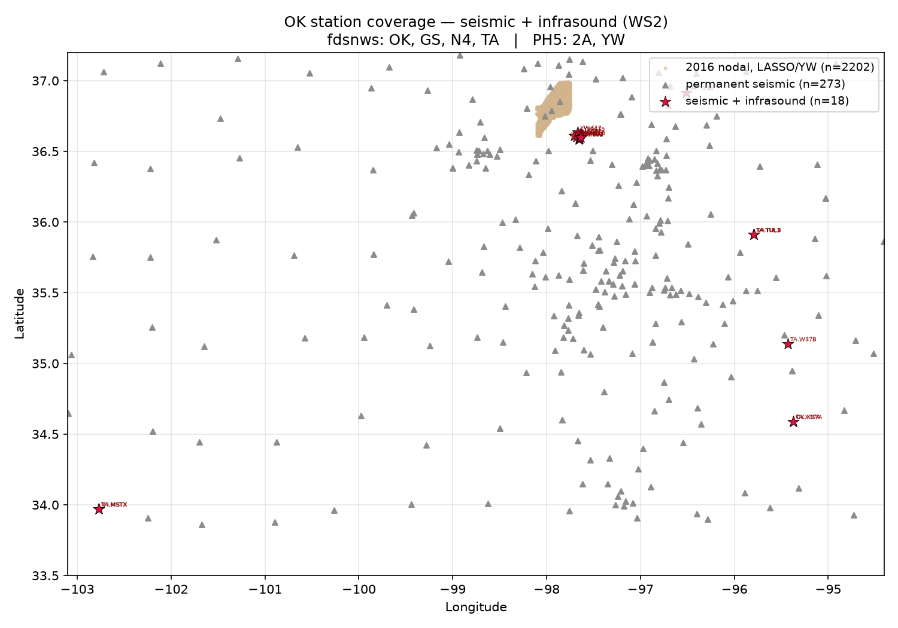

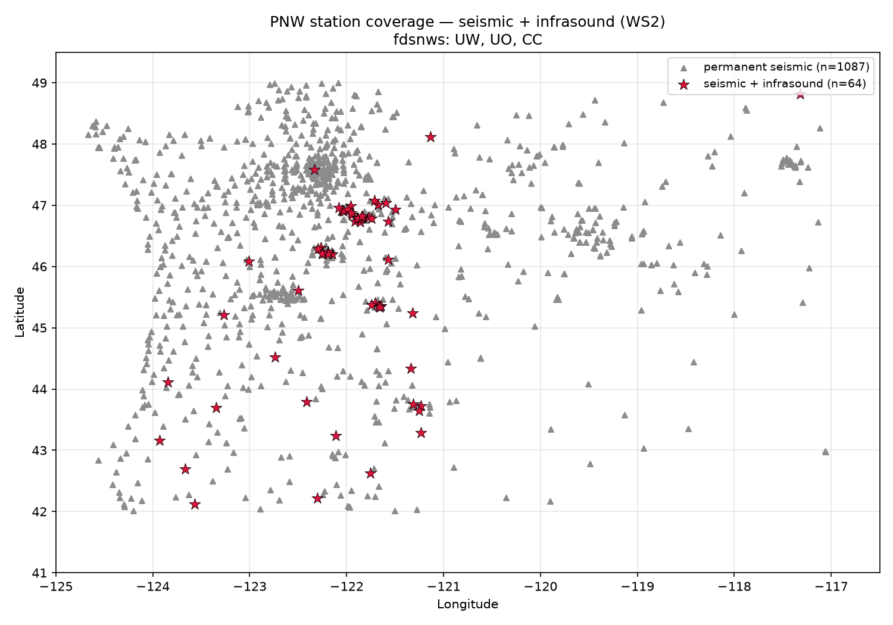

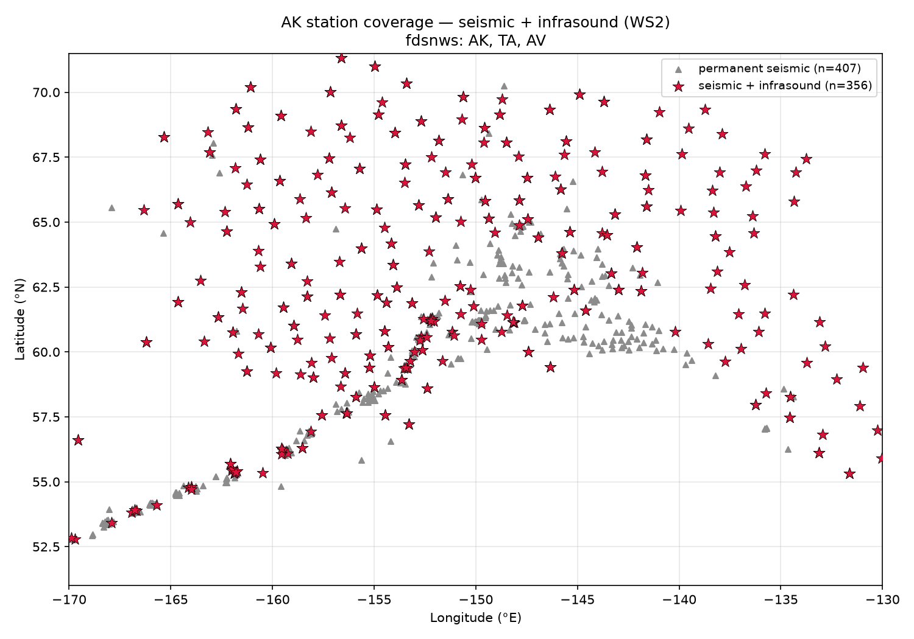
:::

**The inversion**: OK has seismic coverage but almost no infrasound (0.7%); AK has infrasound almost everywhere but the weakest lightning ground truth.

## Data foundations

- **PNWML** — the only analyst-labeled `thunder` class (146 traces), all from PNW networks. Zero Oklahoma examples: any OK model is a genuine cross-region generalization problem.
- **Open-only lightning catalogs** (locked decision, no commercial license): **GOES-GLM** (primary, OK/PNW, 2018+), **WWLLN** (UW-operated, AK backstop), **ALDN** (AK, not yet implemented).
- Two early **negative results** that shaped the whole approach:
  - ASOS airport weather co-location → **0%** — ruled out entirely.
  - PNWML has no OK thunder examples → generalization test is unavoidable.

## What physically distinguishes thunder?

::: {layout-ncol=2}
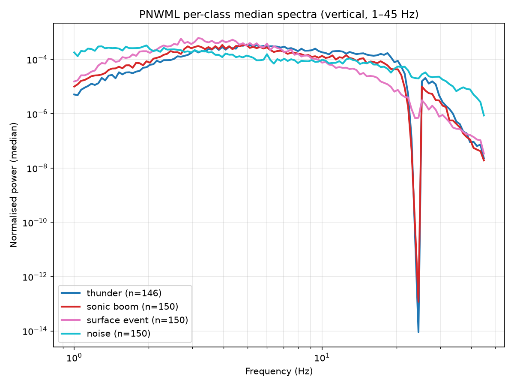

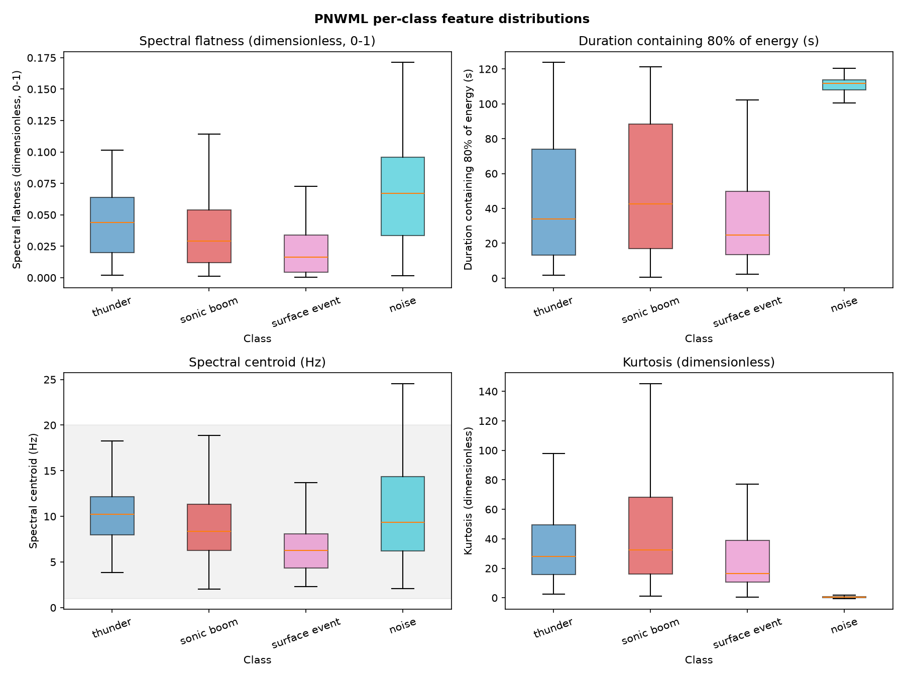
:::

Thunder has the **highest spectral centroid** of the four PNWML classes (10.2 Hz) — a nuance that motivated a follow-up: what's the physical difference between thunder and a sonic boom?

## Thunder vs. sonic boom — why they're hard to separate

::: {layout-ncol=2}
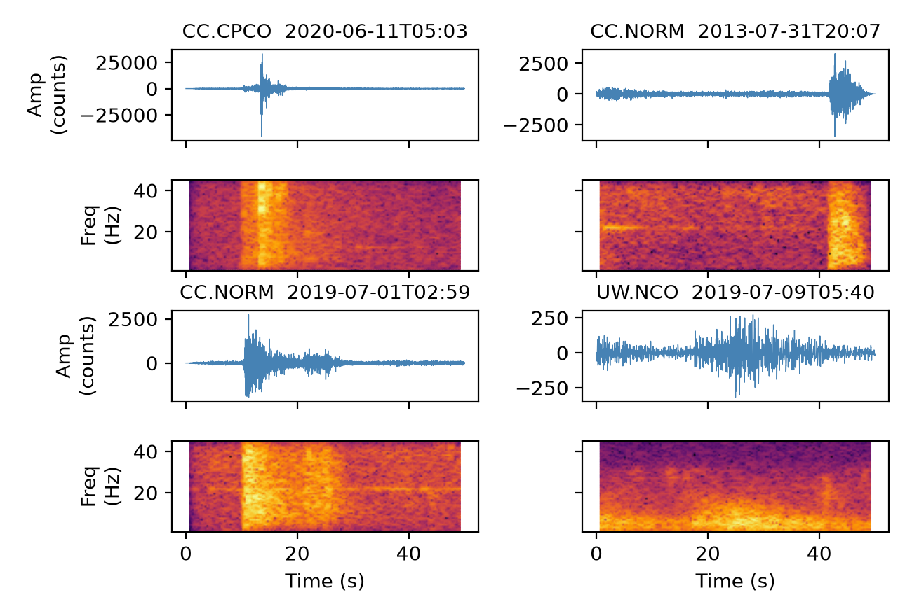{height="330"}

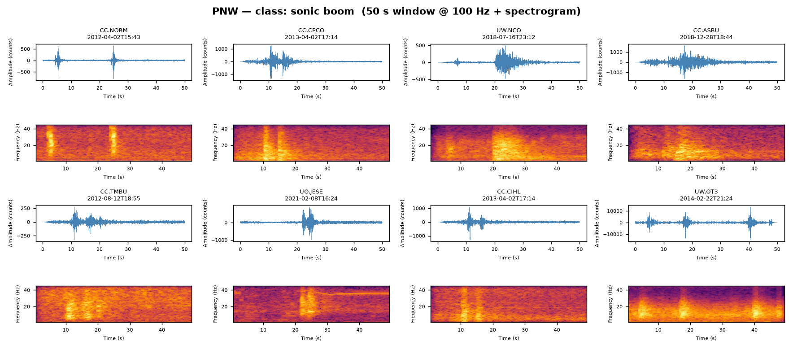{height="330"}
:::

| | Thunder | Sonic boom |
|---|---|---|
| Source | Tortuous channel, multiple strokes | Compact supersonic shock (bow + tail) |
| **Moveout** | Point-source: lag scales with distance from **one** strike | Moving-source: arrivals trace the aircraft's Mach cone, not a point |

## Seismoacoustic coupling — the physical test

Thunder should show seismic + infrasound envelopes correlating strongly at **near-zero lag** — but that lag should also **track strike-to-station distance at ~340 m/s** if it's a real propagating wave, not a coincidence.

::: {layout-ncol=2}
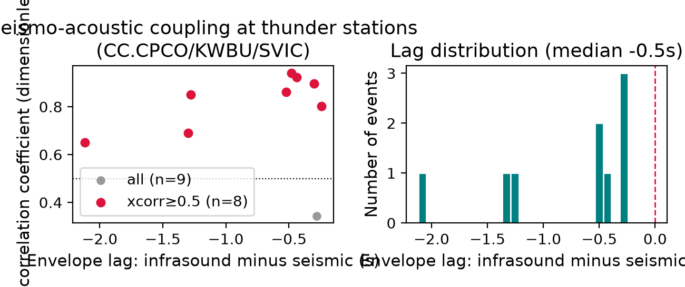{height="330"}

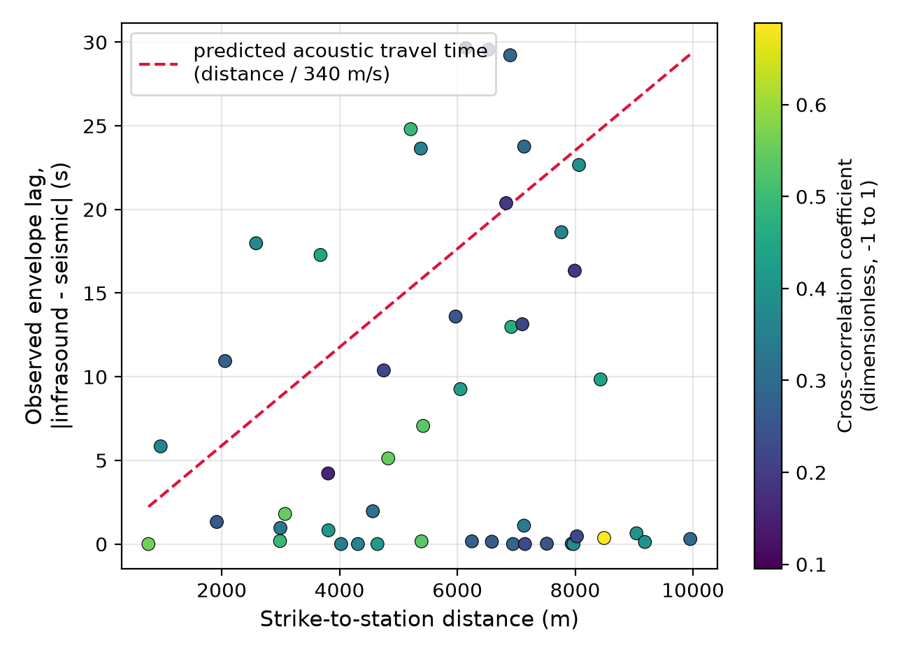{height="330"}
:::

## The classifier (Model A)

- 2D CNN over log-spectrograms, 50 s windows @ 100 Hz.
- Anti-aliased downsampling (MaxBlurPool), short-fat architecture, real-noise-injection augmentation.
- **Station-disjoint** train/test split — the honest precursor to a cross-region test.

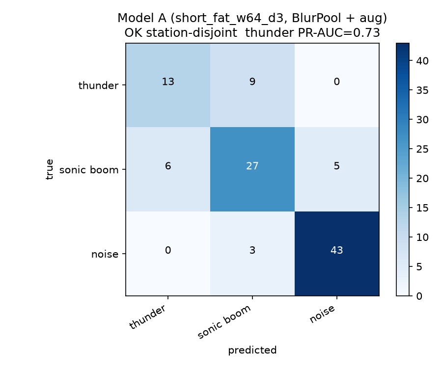{height="400"}

## Does a PNW-trained model transfer to Oklahoma?

Run the model over **continuous** OK data during an active storm; match its candidate windows against GLM strikes; compare against a **null baseline** (same test on random windows) — because during an active storm, almost anything matches *something* by chance.

**5-station, 6-hour test (evening window)**: candidate rate 54% vs. null 42%, **z=1.46, p=0.072** — suggestive, not yet significant.

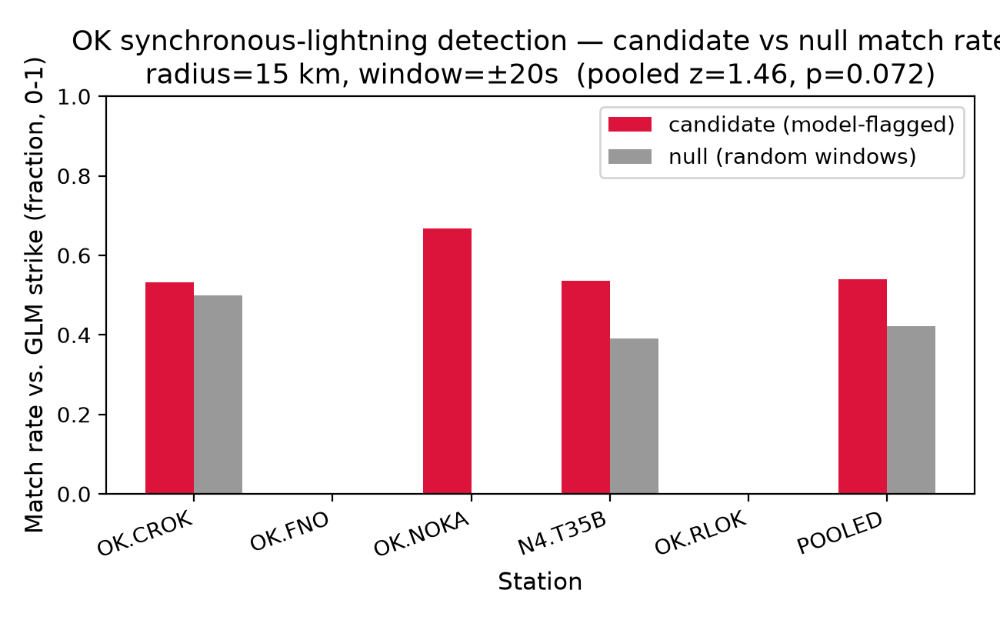{height="380"}

## Does night data look cleaner?

Reran the identical pipeline on a genuinely **nighttime** slice of the same storm (23:00-05:00 local) to test whether daytime cultural/traffic noise was diluting the signal.

| Check | Evening | Night |
|---|---|---|
| Pooled z-test | 54% vs 42%, p=0.072 | **33% vs 12%, p=0.0001** |
| OK.CROK alone | 53% vs 50% (no signal) | 21% vs 21% (no signal) |
| Moveout median deviation | 9.5 s | 16.4 s (worse) |

**Two results point opposite directions** — reported honestly, not cherry-picked: the classifier itself looks *more* trustworthy at night, while the raw seismic-infrasound coupling metric looks *no more* (arguably less) trustworthy, so "night is cleaner" is true for one signal and not the other.

## Net assessment

- The **classifier's** discrimination got dramatically stronger at night (p=0.072 → p=0.0001) — consistent with less daytime noise letting real signal through.
- The **seismic-infrasound coupling metric** did *not* get cleaner at night — the near-zero-lag population (the signature of common-mode contamination) persisted and even grew relatively more prominent.
- This points *toward* **wind** (present day and night) rather than daytime human activity as the likely contaminant of the coupling metric specifically — sharpening, not resolving, an open question.
- **OK.CROK** shows zero candidate-vs-null discrimination in *both* windows — a station-specific issue, not a day/night artifact.

## Where this leaves us

**Confirmed / working:**

- Signal characterization, station inventories, open lightning catalogs, a working CNN, and a real (if not yet fully significant) generalization signal.

**Open / next:**

- Resolve wind vs. genuine acoustic coupling (sliding-window xcorr, spectral matching).
- Scale beyond one storm to reach significance robustly.
- Investigate OK.CROK specifically.

## Roadmap: from proof-of-concept to a production catalog

Four new issues (milestone **M5 — deployment, retraining & catalog production**):

1. **Rapid inference pipeline** — turn one-off scripts into a reusable, benchmarked, unattended pipeline (station list + date range in, standard candidate catalog out).
2. **Iterative retraining loop** — feed vetted OK candidates back into the model; guard against regressing PNW performance.
3. **PNW + Alaska deployment** — validate the same pipeline where labels already exist (PNW), then extend to Alaska once ALDN/WWLLN is wired up.
4. **Cross-validation** against independent streams (WWLLN, NEXRAD, storm reports) — avoid relying on GLM alone for both triggering *and* validating candidates.

## Thanks

**Repo**: [github.com/gaia-hazlab/thunderquakes](https://github.com/gaia-hazlab/thunderquakes)

**Full progress report**: [manuscript.html](manuscript.html)

Questions?
